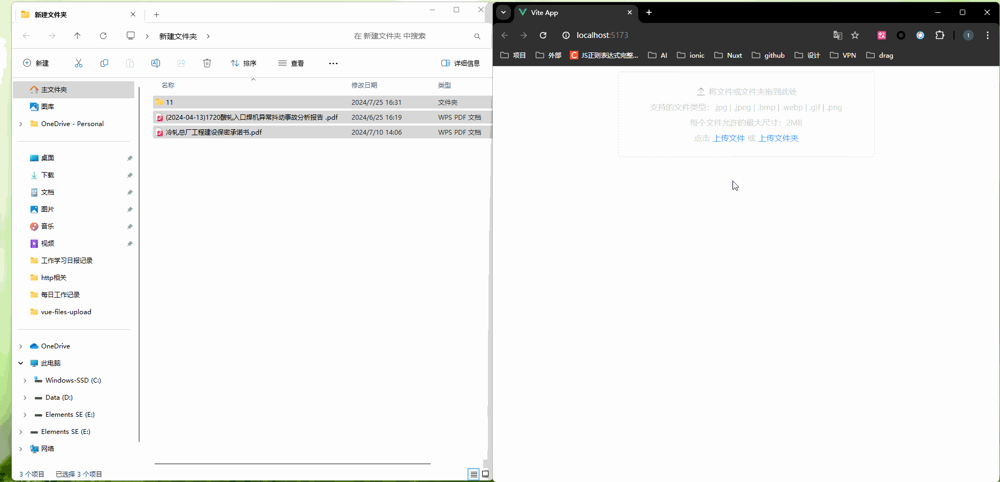

# vue-files-upload

This template should help get you started developing with Vue 3 in Vite.

此组件是基于 vue3 + vite + element plus 的文件上传组件，可以实现多文件和文件夹上传功能。

## 案例演示
**注：** 演示案例中使用了LICEcap软件进行录屏操作。

* 1.初始版本案例

